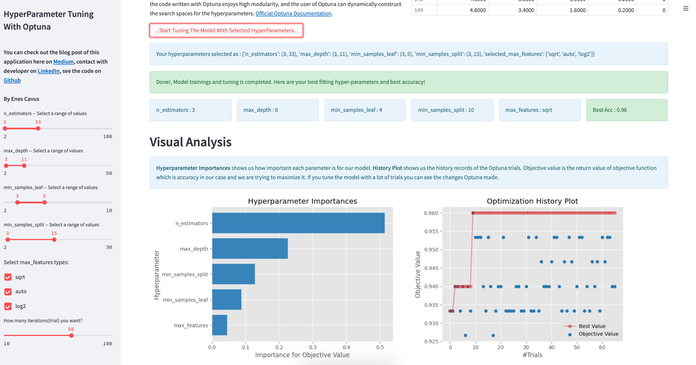

## Hyper-Parameter Optimization w/ Optuna - Streamlit and Random Forest

### Want to learn how this App works? [Blog Post](https://medium.com/@enesblog/optuna-ve-streamlit-ile-hiper-parametre-optimizasyonu-random-forest-f831db7ec405) - [Turkish]  

---

---

#### Built With

- Streamlit
- Optuna
- Sklearn
- Pandas
- Matplotlib
- Numpy
- Plotly

#### Data

- [The Iris Dataset](https://scikit-learn.org/stable/auto_examples/datasets/plot_iris_dataset.html)

#### Models 

- [RandomForestClassifier](https://scikit-learn.org/stable/modules/generated/sklearn.ensemble.RandomForestClassifier.html)

#### Author

- Enes Çavuş - [LinkedIn](https://www.linkedin.com/in/enes-cavus)